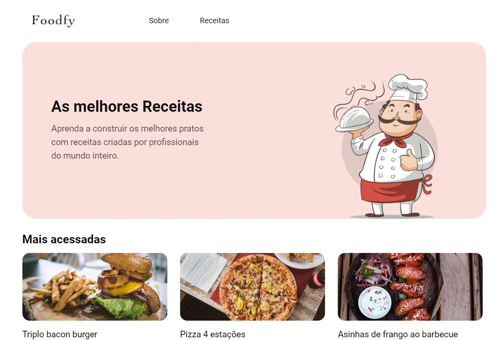
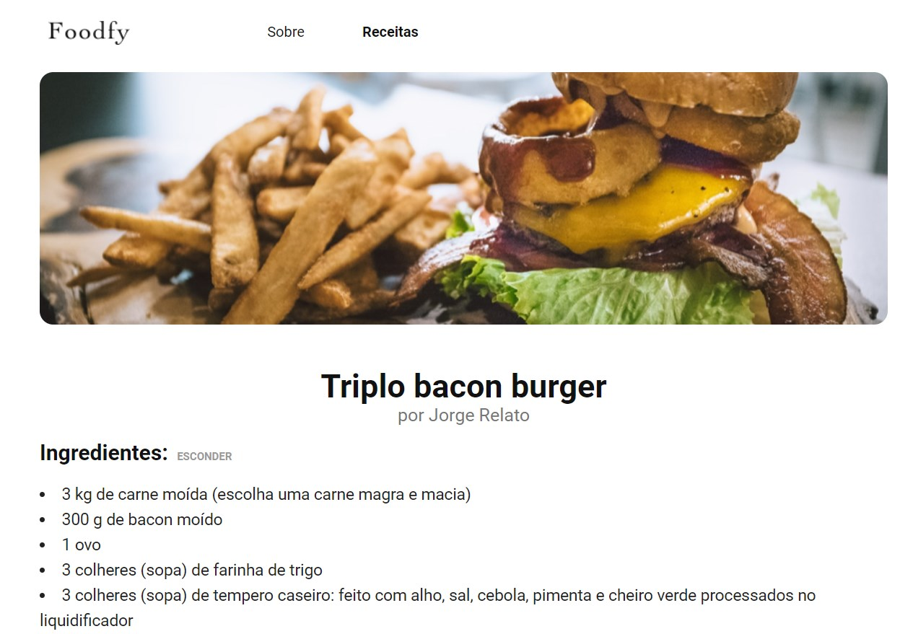
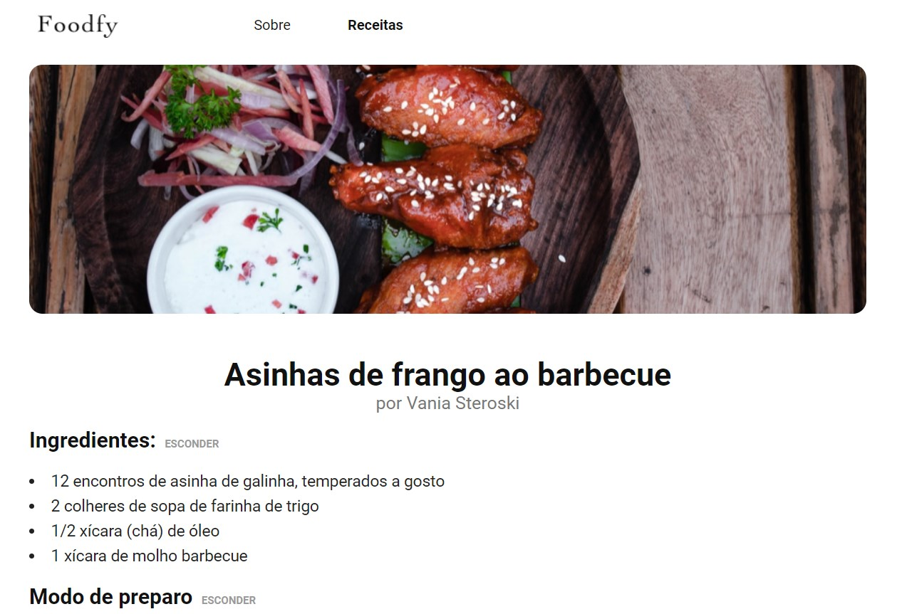
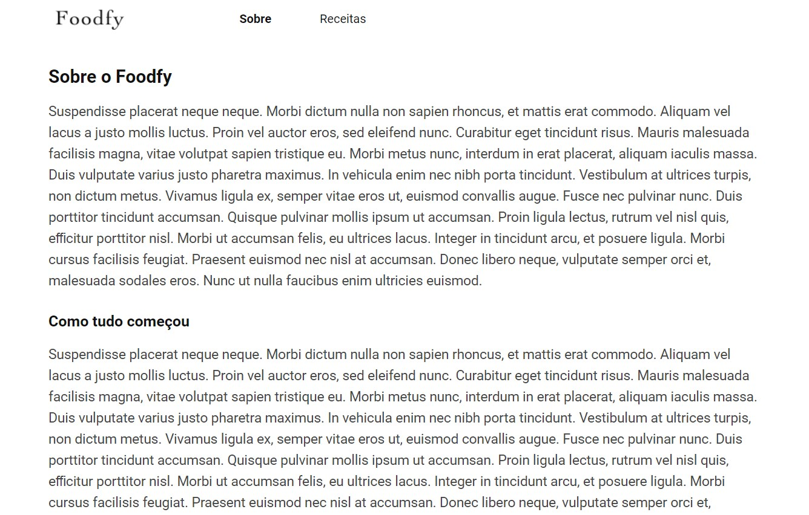

<h1 align="center">
    
</h1>

  <a href="#rocket-about-the-launchbase-bootcamp">About the LaunchBase Bootcamp</a>&nbsp;&nbsp;&nbsp;|&nbsp;&nbsp;&nbsp;
  <a href="#trophy-about-the-challenge">About the challenge</a>&nbsp;&nbsp;&nbsp;|&nbsp;&nbsp;&nbsp;
  <a href="https://github.com/Rocketseat/bootcamp-launchbase-desafios-03/blob/master/desafios/03-refatorando-foodfy.md" target="_blank">Challenge</a>

## :rocket: About the LaunchBase Bootcamp

LaunchBase Bootcamp is an online Bootcamp with an 8 weeks duration. The Bootcamp's goal is to launch your career into the market. During these weeks the student is going to learn about the best technologies for web development. 

## :trophy: About the Challenge

In this challenge, I built a recipe website for a (fictitious) company called Foodfy.

------------

